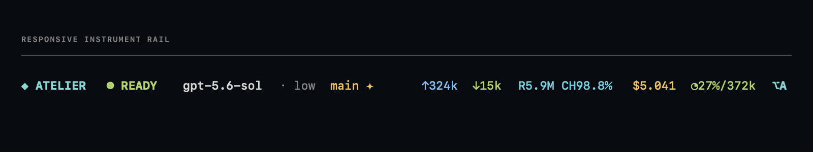

# Pi Atelier

An elegant, information-rich status and menu bar for [Pi](https://pi.dev).

Pi Atelier replaces Pi's default footer with a responsive editorial-luxe bar while preserving the operational metrics that matter during long coding sessions.



## Preview

```text
◆ ATELIER  ● READY  gpt-5.6-sol · low  main ✦        ↑324k ↓15k  R5.9M CH98.8%  $5.041 (sub)  ◔27.0%/372k (auto)  ⌥A MENU
```

Wide terminals use a dual-zone instrument rail: workspace identity stays left while operational telemetry is right-aligned. Semantic jewel-tone colors distinguish input, output, cache, cost, context health, and agent state without hard-coded terminal colors.

## Features

- Preserves cumulative input, output, cache-read, cache-write, cache-hit, cost, subscription, context, and compaction information
- Responsive one-line layout that never wraps
- Model and thinking-level controls
- Searchable tool controls
- Editorial, minimal, and classic display presets
- Session details, renaming, and safe compaction controls
- Theme-aware styling with no hard-coded ANSI colors
- User and trusted-project configuration
- No telemetry or external network requests

## Requirements

- Pi `0.80.7` or newer
- Node.js `22.19.0` or newer
- Interactive TUI mode

## Install

```bash
pi install npm:pi-atelier
```

Try a checkout without installing it permanently:

```bash
pi -e ./pi-atelier
```

Pi packages execute with your full system permissions. Review third-party source before installation.

## Local development

```bash
git clone https://github.com/michaelmjhhhh/pi-atelier.git
cd pi-atelier
npm install
npm run check
pi -e .
```

## Footer anatomy

```text
◆ ATELIER  ● READY │ USAGE + COST │ CONTEXT │ MODEL · THINKING │ GIT │ MENU
```

- `↑` cumulative input tokens
- `↓` cumulative output tokens
- `R` cumulative cache-read tokens
- `W` cumulative cache-write tokens when nonzero
- `CH` cache-hit percentage for the latest assistant response
- `$` cumulative estimated cost
- `(sub)` OAuth subscription-backed access
- `(auto)` automatic context compaction
- `✦` tracked working-tree changes

At 56 columns or wider, required metrics and context remain visible. Below 56 columns, Pi Atelier prioritizes the compact metrics cluster and truncates safely rather than wrapping.

## Menu

Open Pi Atelier with:

```text
/atelier
```

The default shortcut is `alt+a`. The menu contains:

- **Model** — choose an authenticated model or thinking level
- **Tools** — search and toggle active Pi tools
- **Display** — switch presets and save user defaults
- **Session** — inspect, rename, or compact the current session

Additional commands:

```text
/atelier disable
/atelier enable
```

## Configuration

User configuration:

```text
~/.pi/agent/pi-atelier.json
```

Trusted project configuration:

```text
<project>/.pi/pi-atelier.json
```

Project settings override user settings only after Pi trusts the project. Menu changes apply to the current session; **Save as user default** writes user configuration atomically. Pi Atelier never modifies project configuration from the menu.

Complete example:

```json
{
  "preset": "editorial",
  "shortcut": "alt+a",
  "segments": [
    "brand",
    "activity",
    "metrics",
    "context",
    "model",
    "git",
    "statuses",
    "menu"
  ],
  "density": "comfortable",
  "ornament": "restrained",
  "contextWarning": 70,
  "contextDanger": 90,
  "currencyDecimals": 3,
  "showExtensionStatuses": true,
  "showSessionActions": true
}
```

Unknown or invalid values are ignored with one warning. The required `metrics` and `context` segments are restored if omitted.

## Presets

- **editorial** — full Atelier identity and balanced workspace information
- **minimal** — compact activity, metrics, context, model, and menu
- **classic** — restrained metrics, context, model, git, and extension status layout

## Responsive behavior

- **Gallery (132+):** complete left-aligned workspace zone and right-aligned telemetry zone
- **Balanced (96–131):** compact brand, model, Git, telemetry, context, and shortcut groups
- **Focus (72–95):** activity, bounded model identity, core telemetry, context, and shortcut when space permits
- **Telemetry (56–71):** complete compact operational metrics and context without decorative workspace data
- **Safe (<56):** metrics-first ANSI-aware truncation with no wrapping

Color remains semantic at every width: input uses the theme's variable color, output uses success, cache uses type color, cost uses warning/gold, and context transitions from success to warning to error at configured thresholds.

## Privacy and security

Pi Atelier:

- Performs no telemetry, analytics, or network calls
- Does not store prompts, responses, credentials, or session content
- Reads structured usage metadata already available inside Pi
- Executes local `git status --porcelain --untracked-files=no` after relevant events to show tracked dirty state
- Reads project configuration only when Pi reports the project as trusted

## Footer conflicts

Pi supports one custom footer at a time. If multiple extensions call `setFooter`, extension load order determines which footer is visible. Pi Atelier does not wrap undocumented footer internals. Disable it with `/atelier disable` to restore Pi's built-in footer.

## Troubleshooting

### The menu shortcut does not open

Some terminals or personal keymaps intercept `alt+a`. Use `/atelier`, then choose another shortcut in `pi-atelier.json` and run `/reload`.

### Metrics differ from the current context percentage

Token and cost metrics are cumulative across the entire session. Context percentage describes only the current model context after compaction.

### The footer is missing

Pi Atelier intentionally does not install terminal UI in print, JSON, or RPC modes. In TUI mode, check whether another extension replaced the footer later in load order.

## Publishing

Release verification must include:

```bash
npm run check
npm pack --dry-run
npm pack
```

Inspect the tarball before running `npm publish`.

## License

MIT
