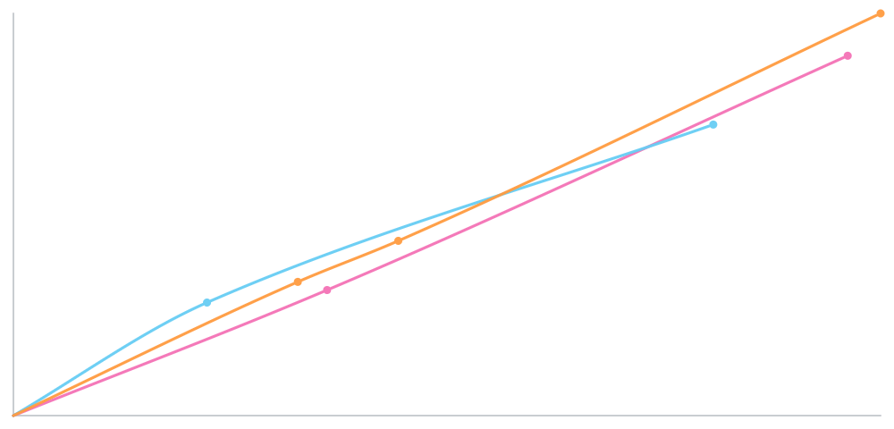

# Issue 69: subagent cost graph — manual verification

This checklist supersedes the earlier table, subtotal and character-only graph designs. No TUI unit or end-to-end tests were added. Automated new coverage is limited to metadata accounting and native event projection.

## Launch

Load the updated worktree and pi-subagents explicitly, disabling discovery of the installed Atelier:

```sh
pi --session-dir "$(mktemp -d)" --no-extensions \
  -e /Users/michael/pi-atelier-issue-69/extensions/index.ts \
  -e /Users/michael/.pi/agent/npm/node_modules/pi-subagents/index.js
```

Use Kitty or Ghostty for smooth native graphics. Keep temporary sessions for reload/resume checks. Metadata must be enabled in pi-subagents. Child runtimes have their own extension configuration.

## Test prompt

```text
使用 pi-subagents 启动一个后台并行 workflow，包含 3 个只读子代理：
1. readme-scout：阅读 README.md，然后再阅读 docs/usage.md，整理功能说明。
2. package-scout：阅读 package.json，然后再阅读 tsconfig.json，整理开发命令和配置。
3. usage-scout：阅读 src/subagent-cost-history.ts，然后再阅读 src/subagent-usage.ts，整理费用数据来源。
每个代理分两次工具调用读取文件，最后各输出约 300 字总结。不要修改文件，不要通过 sleep 拖延时间。启动后告诉我 workflow ID。
```

## TODO: visual checks

- [ ] Open `/atelier` or F6 → Subagent usage. Confirm it shows the same snapshot and point controls as `/atelier usage`; Escape returns to Control Center. Try an untrusted project, disabled Atelier and session switch during refresh: no stale graph should open.

- [ ] Sidebar and `/atelier usage` contain only a graph, matching numbered color legends and essential status text. No token table, per-agent cost list or saved-total block remains.
- [ ] In Kitty/Ghostty, curves are thin continuous smooth lines, with small dots at actual observations. There are no Braille gaps, box-character stairs or rungs joining different agents.
- [ ] Select a child, then press `[` / `]` through every actual observation. Verify the highlighted marker and time/cumulative-cost/reply-cost readout against native events, including the first/last point, one-reply children, zero-cost replies, different history lengths and text fallback. Synthetic zero is not counted as a reply.
- [ ] With 13 or more children, cycle Left/Right through every child, including the earliest one. Its legend page follows focus, while Up/Down changes only the legend page and preserves all curves.
- [ ] The usage dialog has four complete borders and padding. Left/Right dims other curves; A restores them; Escape closes and returns input to the editor.
- [ ] Resize wide/narrow/tall/short. Curves and legends remain inside their frame; tiny windows show a resize hint. An optional sidebar graph disappears as a whole if it cannot fit.
- [ ] Open Settings and other capturing dialogs while a sidebar graph is visible. No sidebar image paints over them. Closing restores the graph without ghosts.
- [ ] Close/reopen usage, reload, disable/re-enable Atelier and switch sessions. No old image remains. Check both regular and fullscreen layouts.
- [ ] In a terminal without Kitty graphics, confirm the character fallback. Check Nerd Font off and NO_COLOR, including single-agent keyboard focus.

## TODO: accounting and lifecycle

- [ ] Run the prompt above. Three separate children of the same `scout` type remain distinct by number and color. Curves appear on completed model replies and refresh while the parent is idle.
- [ ] Run a second batch. All readable child histories are plotted, including more than six. The title shows the total curve count. A bounded sidebar legend shows its visible range; open the expanded view and use Up/Down to see every legend entry. Colors and numbers stay stable as known children produce their first reply.
- [ ] Compare completed curve endpoints with the children's `_meta.json` costs. Repeated `bg_wait`, refresh and reload must not duplicate cost.
- [ ] Main USAGE/footer remain separate. A long-running local tool without model replies does not fabricate extra spend.
- [ ] Missing/disabled/expired metadata, unknown costs, oversized or mismatched histories produce partial/unavailable status. Foreground runs without native background events do not get invented curves.
- [ ] Switch sessions or disable Atelier while work is active. Old sessions do not leak histories into the new one, and retired runtimes stop refreshing.

## Evidence

- Original three-scout workflow replayed from existing native artifacts: 3 curves with 2, 2 and 3 charged replies; final costs $0.0254056, $0.0205456 and $0.0283936.
- Owner validation accepts pi-subagents' session-file identity and Pi's session UUID. Workflow roots are resolved to their child and continuation run IDs rather than charged as children themselves.
- Numeric projections discard event content and tool arguments. Accounting coverage includes duplicate events/sources, same-named steps, partial appends, unknown cost, read bounds/cancellation, ownership and final-metadata reconciliation.
- The native PNG renderer was previewed with the real three-child history. Interactive terminal placement, cleanup and resizing remain manual checks above.

## Review environment and observed evidence

- macOS arm64, repository SDK/Pi baseline 0.84.0; actual interactive host version and terminal cell dimensions were not recorded. The user's 2026-09-25 23:19 screenshot is 1952 × 1275 pixels.
- That screenshot confirms native sidebar curves, point markers and color legends rendered in the user's terminal. It predates removal of the six-curve cap, point inspection and the Control Center entry; those interactive checks remain pending above.
- The screenshot is local conversation evidence, not published in the repository. Native PNG rendering was also previewed against the original three-child history. Automated checks do not establish interactive placement/cleanup correctness.



This 1000 × 480 PNG is a renderer artifact, not an interactive terminal screenshot.
