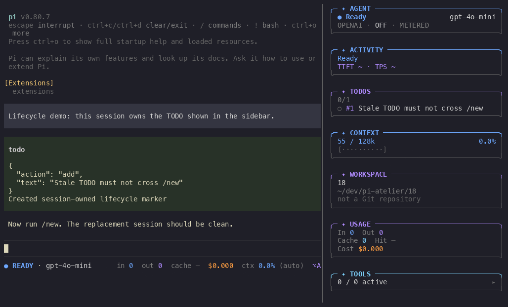
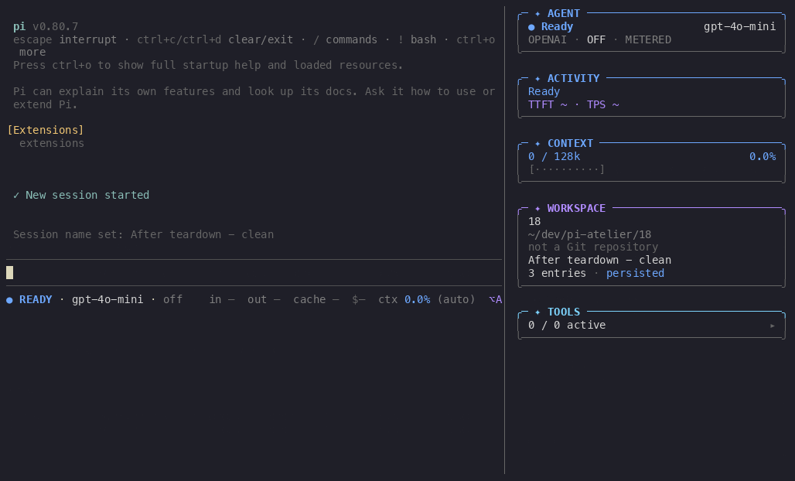

# Session teardown demo

Static final-state evidence for renderers that do not play animated GIFs:

## Capture context

- **Runtime:** repository-local Pi `0.80.7` via `npx --no-install pi -e .`
- **Platform:** macOS `26.5.2` (`25F84`)
- **Terminal:** `120×36` cells in tmux
- **Extension:** package extension entry loaded through `-e .`
- **Recorder:** asciinema `3.2.1`; GIF rendered by agg `1.9.0`
- **Network:** offline; no provider request was made

## Scenario and observed result

The initial persisted session contains one TODO named **“Stale TODO must not cross /new”**. The recording runs `/new`, which exercises Pi's real `session_shutdown` → replacement `session_start` lifecycle, then names the replacement session **“After teardown - clean”**.

After replacement, the TODO panel and its stale item are absent while the new Atelier sidebar and footer remain active. The recording visibly validates TODO/sidebar cleanup; the focused automated lifecycle coverage verifies the manager, listener, render-callback, and runtime invariants.
